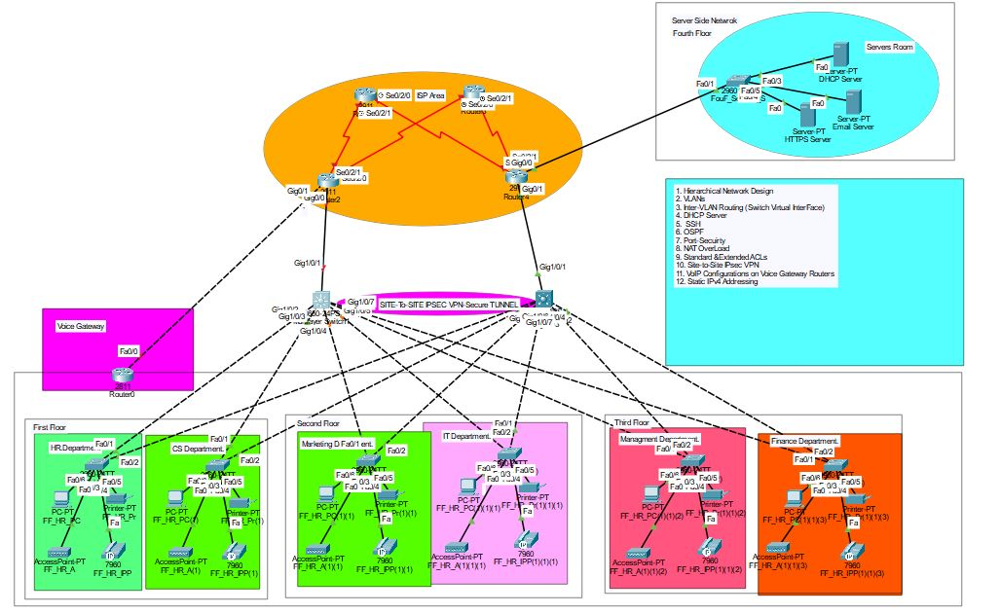

```markdown
# Enterprise Network Configuration with VLAN Segmentation

  
*Note: AI-generated diagram for illustrative purposes. Actual network topology may vary.*

## 📖 Overview
This project sets up a scalable enterprise network using VLANs for departmental segmentation and a multilayer core switch for inter-VLAN routing. The design includes:
- **CoreSwitch**: Central router for VLAN traffic.
- **Department Access Switches**: HR, CS, Marketing, IT, Management, and Finance.
- **ServerSwitch**: Dedicated to server resources (DHCP, Email, HTTPS).

## 🌐 Network Topology
### Core Infrastructure
- **CoreSwitch (Multilayer Switch)**  
  - **Role**: Inter-VLAN routing and trunking to all switches.
  - **Trunk Ports**: `GigabitEthernet0/1` and `GigabitEthernet0/2` (carry all VLANs).
  - **VLANs**:
    | VLAN ID | Name          | Subnet          |
    |---------|---------------|-----------------|
    | 10      | HR            | 192.168.10.0/24 |
    | 20      | CS            | 192.168.20.0/24 |
    | 30      | Marketing     | 192.168.30.0/24 |
    | 40      | IT            | 192.168.40.0/24 |
    | 50      | Management    | 192.168.50.0/24 |
    | 60      | Finance       | 192.168.60.0/24 |
    | 100     | DHCP_Server   | 192.168.100.0/24|
    | 110     | Email_Server  | 192.168.110.0/24|
    | 120     | HTTPS_Server  | 192.168.120.0/24|

### Department Access Switches
- **HR_Switch, CS_Switch, etc.**  
  - **Role**: Connect end devices to their respective VLANs.
  - **Access Ports**: `FastEthernet0/1-12` assigned to department VLAN.
  - **Trunk Uplink**: `GigabitEthernet0/1` to CoreSwitch.

### Server-Side Switch
- **ServerSwitch**  
  - **Role**: Hosts servers in dedicated VLANs (100, 110, 120).
  - **Trunk Uplink**: `GigabitEthernet0/1` to CoreSwitch (carries server and department VLANs).

## 🛠 Configuration Highlights
### CoreSwitch Setup
```plaintext
! Enable Layer 3 routing
ip routing

! Create VLANs
vlan 10
 name HR
...

! Configure SVIs for routing
interface Vlan10
 ip address 192.168.10.1 255.255.255.0
 no shutdown
...

! Trunk ports
interface GigabitEthernet0/1
 switchport mode trunk
 switchport trunk allowed vlan 10,20,30,40,50,60,100,110,120
```

### Department Switch Example (HR_Switch)
```plaintext
! Assign access ports to VLAN 10
interface range FastEthernet0/1-12
 switchport mode access
 switchport access vlan 10

! Trunk uplink
interface GigabitEthernet0/1
 switchport mode trunk
 switchport trunk allowed vlan 10,20,30,40,50,60
```

### Security Features
- **Banner Messages**: Custom MOTD for device identification.
- **Password Encryption**: 
  ```plaintext
  service password-encryption
  line console 0
   password cisco
   login
  ```
- **SSH Access**:
  ```plaintext
  line vty 0 4
   transport input ssh
  ```

## 🔄 How It Works
1. **Inter-VLAN Routing**: CoreSwitch routes traffic between VLANs using SVIs.
2. **Traffic Isolation**: Departments are segmented into VLANs for security and performance.
3. **Trunk Links**: Carry multiple VLANs between switches over a single physical connection.
4. **Server Connectivity**: Servers communicate with departments via trunked VLANs.

## 📥 Deployment
1. Copy configurations from `Configs.txt` or `Configs_With_IPs.txt` to respective switches.
2. Verify trunk/allowed VLANs match between switches.
3. Enable `ip routing` on CoreSwitch.

## ✅ Verification Commands
```plaintext
show vlan brief          # Check VLAN assignments
show ip interface brief  # Verify SVI status
show interfaces trunk    # Confirm trunk configurations
show running-config      # Review current settings
```

## 📝 Conclusion
This setup provides a secure, segmented network with centralized routing. Departments operate in isolated VLANs, while servers are accessible across the network via trunk links. For detailed configurations, refer to the provided `.txt` files.
