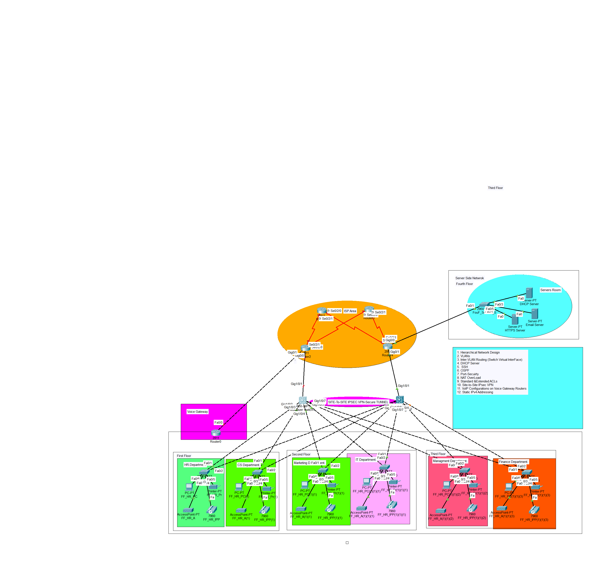

# 🌐 Enterprise Network Configuration Project



## 📌 Overview
This project details a **comprehensive enterprise network setup** using VLAN segmentation and a multilayer core switch to manage inter-VLAN routing. It includes configurations for:
- Departmental **Access Switches**
- A dedicated **Server-Side Switch**
- **Inter-VLAN Routing**
- **Trunk Links**
- **DHCP, Email, and HTTPS Servers**

---

## 🏗 Network Architecture & Topology

The network is designed to be **scalable, secure, and efficient**:

🔹 **Core Switch** - Manages inter-VLAN routing and connects all switches via trunk links.  
🔹 **Departmental Switches** - HR, CS, Marketing, IT, Management, and Finance, each with a unique VLAN.  
🔹 **Server Switch** - Manages DHCP, Email, and HTTPS servers.  

---

## ⚙️ Configuration Details

This repository contains essential configuration files and documentation:

📂 **Configs_With_IPs.txt** – Complete network configuration with IP addressing.  
📂 **Configs.txt** – VLAN and trunk configurations.  
📂 **Infa_Document_One.docx** – Network topology & design documentation.  
📂 **Infa_Document_Two.docx** – Command-by-command network setup guide.  
📂 **MainInfa.pkt** – Cisco Packet Tracer simulation file.  

---

## 🔧 How It Works

- **🔹 Inter-VLAN Routing** – Configured on the Core Switch using SVIs.
- **🔹 VLAN Segmentation** – Each department is isolated for security.
- **🔹 Trunk Links** – Allow multiple VLAN traffic over a single connection.
- **🔹 DHCP, Email, and HTTPS Services** – Managed via dedicated VLANs.

---

## 📂 Repository Structure

```plaintext
📦 Enterprise-Network-Project
 ├── 📜 README.md  (This file)
 ├── 📂 configs
 │   ├── 📜 Configs_With_IPs.txt
 │   ├── 📜 Configs.txt
 ├── 📂 docs
 │   ├── 📜 Infa_Document_One.docx
 │   ├── 📜 Infa_Document_Two.docx
 ├── 📂 packettracer
 │   ├── 📜 MainInfa.pkt
 ├── 📂 images
 │   ├── 🖼 View.png  (Network topology diagram)
